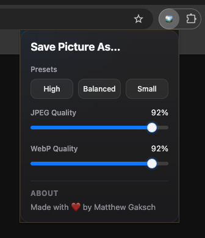
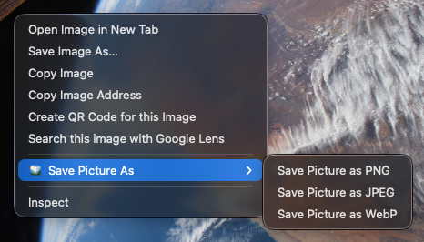

# Save Picture As…

A fast, privacy-friendly browser extension that lets you save pictures as PNG, JPEG, or WebP — directly from the right-click menu.

## 🌐 Download

Get the extension from your browser’s store:

- 🟦 Microsoft Edge:  
  https://microsoftedge.microsoft.com/addons/detail/save-picture-as/ndnaijongmaianoggepapofmiemjnmmc

- 🌍 Chrome Web Store:  
  _Coming soon_

- 🟥 Opera Add-ons:  
  _Coming soon_

## Supported Browsers

- Google Chrome
- Microsoft Edge
- Opera
- Other Chromium-based browsers (e.g. Brave, Vivaldi, Arc)

## Features

- Right-click to save pictures in different formats across supported browsers
- Supports **PNG, JPEG, WebP**
- Adjustable quality for JPEG and WebP
- Quick presets: **High (92%)**, **Balanced (80%)**, **Small (60%)**
- Smart transparency handling for JPEG
- Clean, minimal popup UI
- Fully local processing (no uploads)
- Fast and lightweight

## Why

Most image-saving tools either reduce quality or rely on external services.  
This extension keeps everything local, fast, and under your control.

Works consistently across modern Chromium-based browsers without relying on external services.

## Screenshots

### Popup UI – Adjust quality and presets

### Context Menu – Save as PNG, JPEG, or WebP

## Installation

1. Open `chrome://extensions/`
2. Enable **Developer Mode**
3. Click **Load unpacked**
4. Select this folder

## Usage

- Right-click on any picture
- Choose:
  - **Save Picture as PNG**
  - **Save Picture as JPEG**
  - **Save Picture as WebP**
- Optionally adjust quality via the extension popup

## Privacy Policy

Save Picture As does not collect, store, or transmit any personal data.

All picture processing is performed locally within the user's browser. The extension does not upload pictures, track browsing activity, or send data to external servers.

Permissions are used only for core functionality:

- `contextMenus` is used to add right-click save options for pictures
- `downloads` is used to save converted picture files to the user's device
- `offscreen` is used to run local canvas-based picture conversion
- `storage` is used to save user preferences such as JPEG and WebP quality settings
- Host permissions are used only to fetch the picture the user explicitly selects for local conversion

Save Picture As does not use analytics, advertising, tracking scripts, or third-party services.

If you have any questions, you can contact:
Matthew Gaksch  
matthew@gaksch.net

## Permissions

- `contextMenus` → add right-click menu
- `downloads` → save converted files
- `offscreen` → run hidden local canvas conversion
- `storage` → save popup quality preferences

The extension also requests host access for `http://*/*` and `https://*/*` so it can fetch the original picture data for local conversion.

## Development

- Manifest V3
- Vanilla JavaScript
- Offscreen document for canvas processing
- Popup UI for quality settings

## ❤️ Support

If you like this project, consider:
- ⭐ Starring the repo
- ☕ Supporting my work: https://buymeacoffee.com/matthewgaksch

## Open Source

This project is fully open source. You can view the source code and contribute on GitHub.

## License

MIT License

---

This project is an independent implementation and is not affiliated with or endorsed by any other browser extensions.

---

Made with ❤️ by Matthew Gaksch
